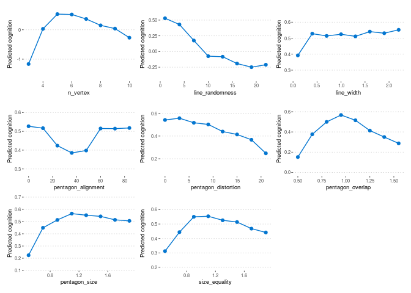

Visualize the result of simulation experiment
================

``` r
library(tidyverse)
```

    ## ── Attaching packages ─────────────────────────────────────── tidyverse 1.3.2 ──
    ## ✔ ggplot2 3.4.1     ✔ purrr   1.0.1
    ## ✔ tibble  3.1.8     ✔ dplyr   1.1.0
    ## ✔ tidyr   1.3.0     ✔ stringr 1.5.0
    ## ✔ readr   2.1.4     ✔ forcats 1.0.0
    ## ── Conflicts ────────────────────────────────────────── tidyverse_conflicts() ──
    ## ✖ dplyr::filter() masks stats::filter()
    ## ✖ dplyr::lag()    masks stats::lag()

``` r
library(ggsci)
library(ggpubr)
theme_pwas = theme_pubclean(base_size = 7,base_family = "Helvetica")

p_list=list()
attribute_name ="n_vertex"
p_list[[attribute_name]]=lapply(paste0("../results/simulate_pentagon/",attribute_name,"/vgg19_bn-",1:10,"_model.txt"),function(x){
  read.delim(x)%>%
    return()
})%>%bind_rows()%>%
  group_by(n)%>%#summarise(pred=median(pred))%>%
  summarise(pred_mad=mad(pred),
            pred=median(pred))%>%
  ggplot(.,aes(n,pred,ymin=pred-pred_mad,ymax=pred+pred_mad))+
  geom_line(color="#0476D0")+
  geom_point(color="#0476D0")+
  #geom_pointrange(size=0.1)+
  scale_color_jama()+
  theme_pwas+#stat_compare_means()+
  ylab("Predicted cognition")+
  theme(legend.position = "none")+
  xlab(attribute_name)


make_plot = function(p_list,attribute_name){
  p_list[[attribute_name]]=lapply(paste0("../results/simulate_pentagon/",attribute_name,"/vgg19_bn-",1:10,"_model.txt"),function(x){
    read.delim(x)%>%
      return()
  })%>%bind_rows()%>%
    group_by(n)%>%
    summarise(pred_mad=mad(pred),
              pred=median(pred))%>%
    ggplot(.,aes(n,pred,ymin=pred-pred_mad,ymax=pred+pred_mad))+
    geom_line(color="#0476D0")+
    geom_point(color="#0476D0")+
    scale_color_jama()+
    theme_pwas+
    ylab("Predicted cognition")+
    theme(legend.position = "none")+
    xlab(attribute_name)
  return(p_list)
}

attribute_name ="line_randomness"
p_list = make_plot(p_list,attribute_name)

attribute_name ="line_width"
p_list = make_plot(p_list,attribute_name)

attribute_name ="pentagon_alignment"
p_list = make_plot(p_list,attribute_name)

attribute_name ="pentagon_distortion"
p_list = make_plot(p_list,attribute_name)

attribute_name ="pentagon_overlap"
p_list = make_plot(p_list,attribute_name)

attribute_name ="pentagon_size"
p_list = make_plot(p_list,attribute_name)

attribute_name ="size_equality"
p_list = make_plot(p_list,attribute_name)

patchwork::wrap_plots(p_list,ncol = 3)
```

<!-- -->
